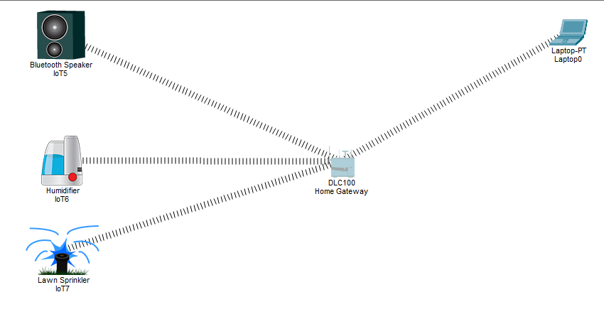
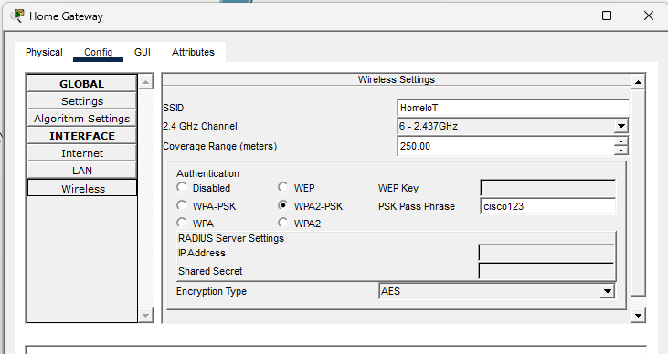
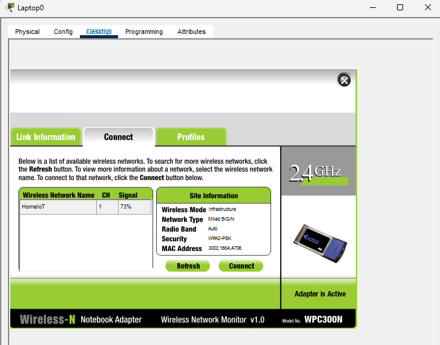
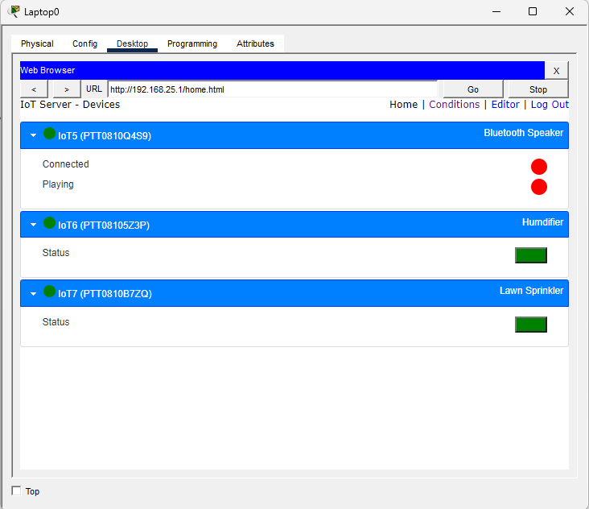

# Smart Home IoT System (Cisco Packet Tracer)

## Overview

This project simulates a Smart Home IoT system using Cisco Packet Tracer. It demonstrates how IoT devices communicate over a wireless network and are controlled through a central Home Gateway.

The system includes smart devices such as a Bluetooth speaker, humidifier, and lawn sprinkler, all connected via Wi-Fi and managed in real time from a laptop.

---

## Objectives

- Design a smart home IoT network  
- Configure wireless Home Gateway (HomeNet)  
- Connect IoT devices to a shared network  
- Enable real-time monitoring and control  
- Demonstrate IoT communication in a simulated environment  

---

## Network Architecture

Home Gateway acts as the central controller connecting all IoT devices and the user laptop via Wi-Fi.

---

## Network Topology

---

## Implementation

### 1. Home Gateway Configuration

- SSID: HomeIoT  
- Security: WPA2-PSK  
- Password: cisco123  
- DHCP enabled  

---

### 2. Laptop Connection

The laptop connects to the Home Gateway via Wi-Fi.

---

### 3. IoT Device Connection

All smart devices successfully connected to the network:

- Bluetooth Speaker  
- Humidifier  
- Lawn Sprinkler  

Devices show wifi signal connected to the home gateway.

---

### 4. Device Control

Devices were controlled in real time from the laptop interface.

---

## Results

- All IoT devices connected successfully  
- Real-time wireless communication achieved  
- Home Gateway acted as central controller  
- Devices responded instantly to user commands  

---

## Key Learnings

- IoT networking in Packet Tracer  
- Wireless home network configuration  
- DHCP-based IP assignment  
- Smart device integration and control  
- Real-time IoT automation concepts  

---

## 📁 Project Structure

Smart-Home-IoT-System/
- README.md  
- project.pkt  
- screenshots/  
  - topology.png  
  - gateway.png  
  - laptop.png  
  - devices.png  
  - control.png  

---

## Future Improvements

- Motion sensor automation  
- Scheduling for sprinkler system  
- Multi-room smart home expansion  
- Cloud IoT integration  

---

## Author

Idam Okechukwu Samuel  
Software Engineering (Java/.Net)

---

## Status

✔ Completed Simulation  
✔ Fully Functional Smart Home IoT System  
✔ Portfolio Ready
